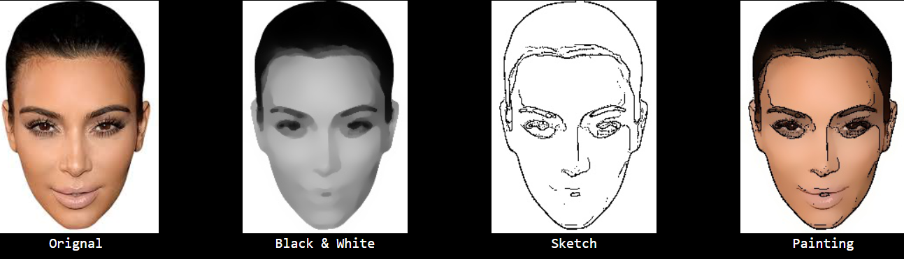
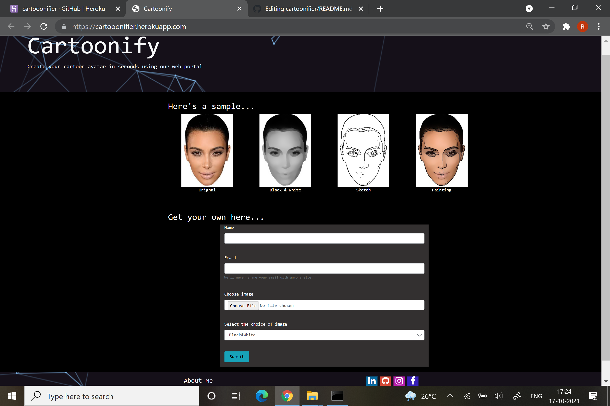
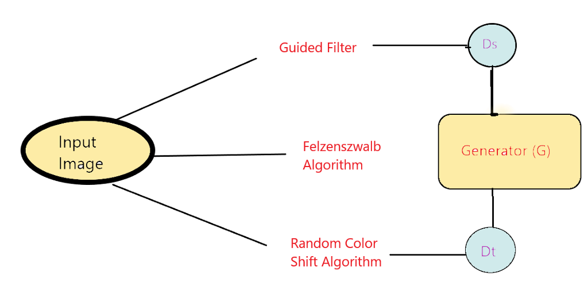

# CARTOONIFIER

We can create three type of images:-
1. Sketch
2. Black and white
3. Painting

and the final result is sent to the user on their email id.

# Workflow
--> The input is first passed through Surface representation where Structural and Textural features are removed, once we imitate cartoon painting style and smooth surfaces, the output is passed through guided filters in order to retain smooth edges. A discriminator Ds is proposed to verify whether result and paired cartoon images have similar surfaces, and regulate the generator G to learn the information stored in the extracted surface representation. 
--> The structural features are then passed through Structural representation that clear boundaries in the cellular style framework and then we implement Felzenszwalb algorithm to segment the areas. The algorithm assists us in coloring each segment with an average pixel value. To impose a spatial constraint on global content between outputs and provided paired cartoons we use pre-trained VGGNetwork. 
--> The variation of luminance and color information are non-trivial issues to the model, therefore, we choose a random color shift algorithm to convert three-channel input to single-dimension outputs that cling to high-quality features. A discriminator Dt is then proposed to verify textual features from the result and paired cartoon image, and regulates generator G to learn the information stored in extracted texture representation.

# How to use 
Visit the website https://cartooonifier.herokuapp.com/ to view the application. Fill the form as shown, file and select the options to get required output.

# How to replicate
Basic requirements- Python 3.7 or above  
Step 1. clone and download the project  
Step 2. run command pip install -r requirements.txt  
Step 3. run command app.py and open localhost:5000 to view the application

# Screenshots of website

# Methodology flowchart

